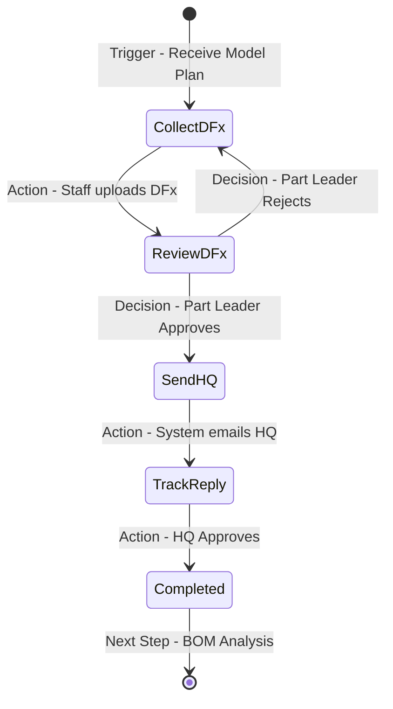
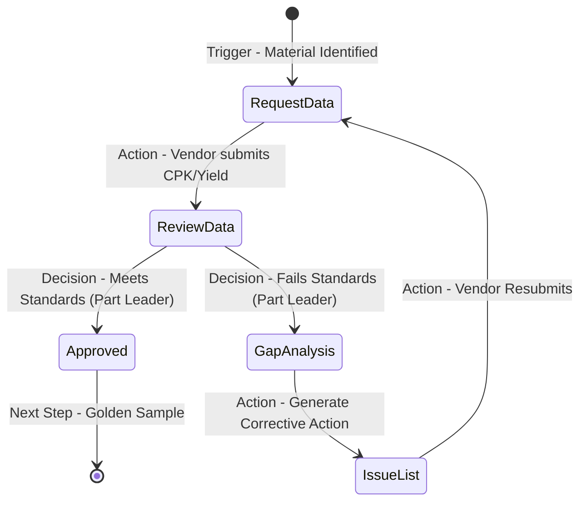
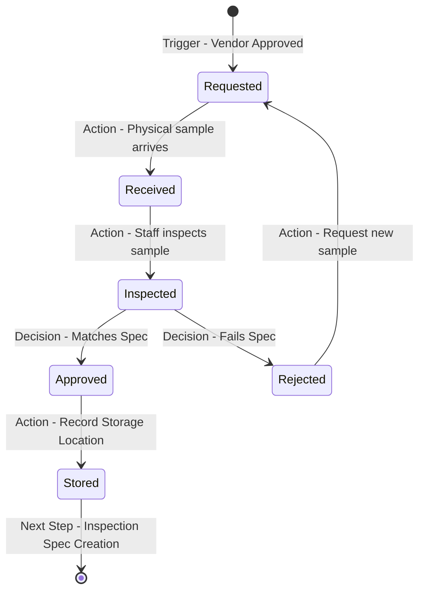

# 05. Workflow Layer

## DFx Tracking Workflow

```mermaid
stateDiagram-v2
    [*] --> CollectDFx: Trigger - Receive Model Plan
    CollectDFx --> ReviewDFx: Action - Staff uploads DFx
    ReviewDFx --> SendHQ: Decision - Part Leader Approves
    ReviewDFx --> CollectDFx: Decision - Part Leader Rejects
    SendHQ --> TrackReply: Action - System emails HQ
    TrackReply --> Completed: Action - HQ Approves
    Completed --> [*]: Next Step - BOM Analysis
```

## Vendor Capability Approval Workflow

```mermaid
stateDiagram-v2
    [*] --> RequestData: Trigger - Material Identified
    RequestData --> ReviewData: Action - Vendor submits CPK/Yield
    ReviewData --> Approved: Decision - Meets Standards (Part Leader)
    ReviewData --> GapAnalysis: Decision - Fails Standards (Part Leader)
    GapAnalysis --> IssueList: Action - Generate Corrective Action
    IssueList --> RequestData: Action - Vendor Resubmits
    Approved --> [*]: Next Step - Golden Sample
```

## Golden Sample Workflow

```mermaid
stateDiagram-v2
    [*] --> Requested: Trigger - Vendor Approved
    Requested --> Received: Action - Physical sample arrives
    Received --> Inspected: Action - Staff inspects sample
    Inspected --> Approved: Decision - Matches Spec
    Inspected --> Rejected: Decision - Fails Spec
    Rejected --> Requested: Action - Request new sample
    Approved --> Stored: Action - Record Storage Location
    Stored --> [*]: Next Step - Inspection Spec Creation
```
