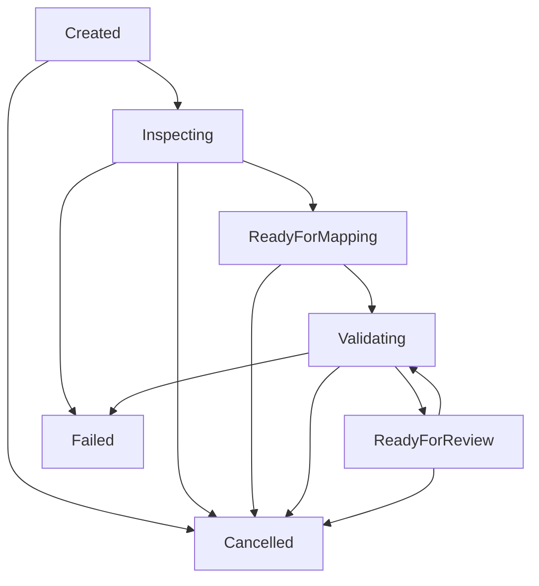

# Import Lifecycle Specification

The authoritative backend lifecycle state machine is:

`Created -> Inspecting -> ReadyForMapping -> Validating -> ReadyForReview`

## Lifecycle Principles & Rules

1. **State Machine Authority**: `ImportJobTransitionGuard` in `IqcQms.Application.DataPlatform` is the single source of truth for all lifecycle state transitions.
2. **Inspection Phase**: Normalization converts CSV/XLSX source files into a provider-neutral `NormalizedWorkbook`. NASCA formats and unsupported extensions are strictly rejected during upload inspection.
3. **Mapping Phase**: Mapping profile configuration translates source headers to target schema fields. Applying mapping transitions state from `ReadyForMapping` to `Validating`.
4. **Validation Phase**: The validation engine evaluates field and record rules. Re-running validation remains in `Validating` or `ReadyForReview`.
5. **Review & Preview Phase**: Generating preview creates a tamper-evident HMAC-SHA256 attestation fingerprint and transitions job to `ReadyForReview`.
6. **Deferred Commitment**: Production database commit persistence (`Committing` -> `Completed`) is explicitly deferred in this milestone. No public API route or frontend UI activates commit transitions.
7. **Terminal States**: `Failed` and `Cancelled` are terminal states.
8. **Ownership & Access**: Jobs are owned by authenticated creators. Operations require ownership or `import.admin` policy authorization.
