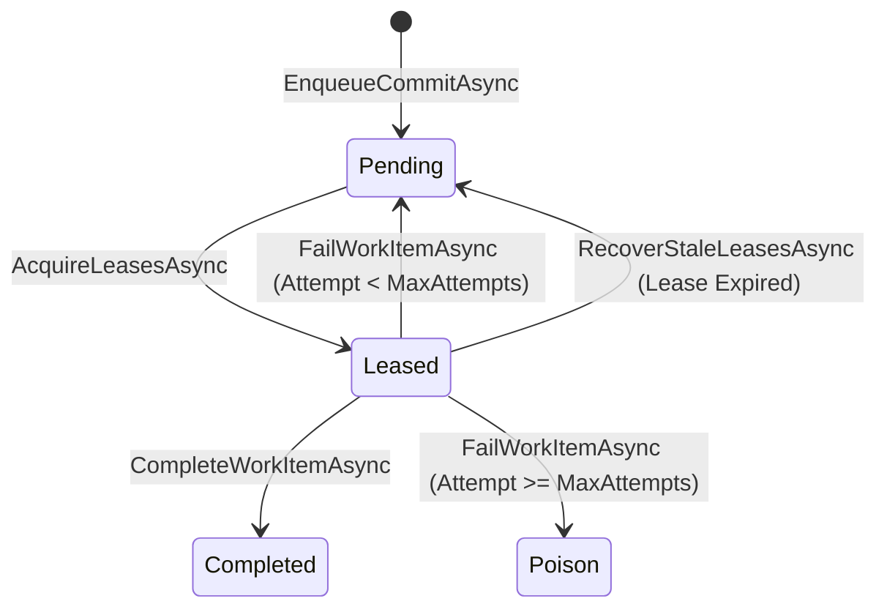

# Background Processing Specification: Durable Work Queue & Commit Worker

## 1. Overview

The IQC Nexus Import Platform executes database target writes asynchronously via a durable EF Core work queue (`PersistentImportWorkItems` table) and ASP.NET Core `BackgroundService` worker (`ImportCommitBackgroundWorker`).

---

## 2. Work Item State Machine

---

## 3. Worker Configuration & Concurrency

* **Polling Interval**: Default 1,000 ms.
* **Batch Size**: Default 3 work items per batch.
* **Lease Duration**: 2 minutes per lease.
* **Max Attempts**: Default 3 attempts.
* **Backoff Strategy**: Exponential backoff ($2^{\text{AttemptCount}} \times 2$ seconds).
* **Worker Concurrency**: Limited by `SemaphoreSlim(3)` to bound CPU and database connection usage.

---

## 4. Operational Recovery Procedures

1. **Stale Lease Recovery**: `RecoverStaleLeasesAsync` automatically checks every 30 seconds for leases where `LeaseExpiresAtUtc < DateTimeOffset.UtcNow` and resets state to `Pending`.
2. **Poison Work Item Remediation**: Work items that reach `MaxAttempts` are marked `Poison`. Operators inspect `LastErrorCode` and `LastErrorMessage` in the database or admin view before resetting.
