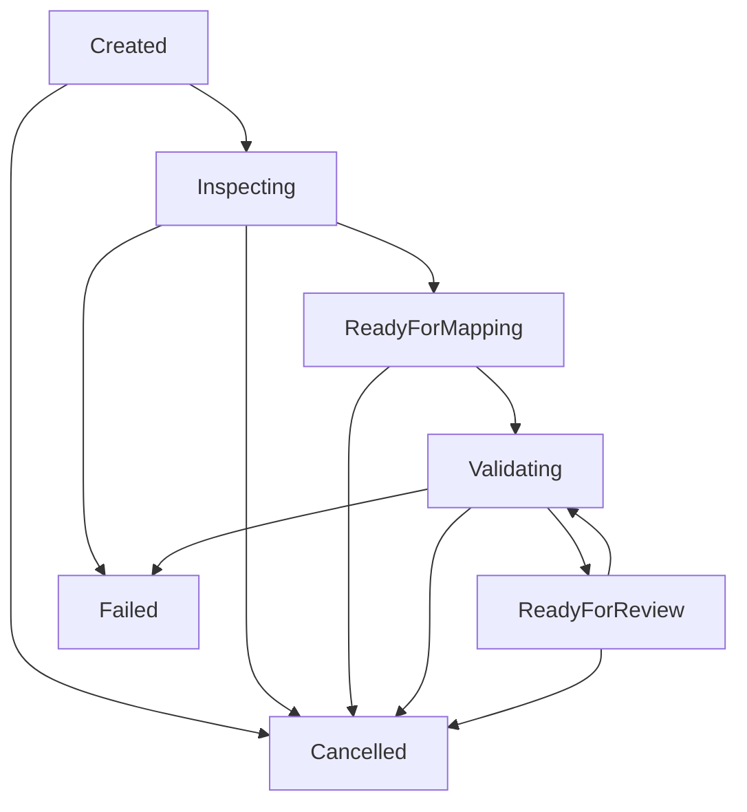

# Import Job Lifecycle Architecture

## Authoritative Lifecycle States

## State Descriptions

1. **`Created`**: Job initialized with source descriptor payload.
2. **`Inspecting`**: Source provider inspection and normalization into `NormalizedWorkbook`. NASCA files are rejected.
3. **`ReadyForMapping`**: Workbook normalized and ready for mapping configuration.
4. **`Validating`**: Mapping profile applied; validation engine evaluating rules.
5. **`ReadyForReview`**: Validation complete and Preview Attestation generated. Re-running mapping or validation returns state to `Validating`.
6. **`Cancelled`**: Job cancelled by owner or administrator.
7. **`Failed`**: Execution error during normalization or validation.

## Deferred States

* `Committing` and `Completed` are reserved as future contract states. They are not activatable by any public REST endpoint in this milestone, and production database commit persistence is explicitly deferred.
