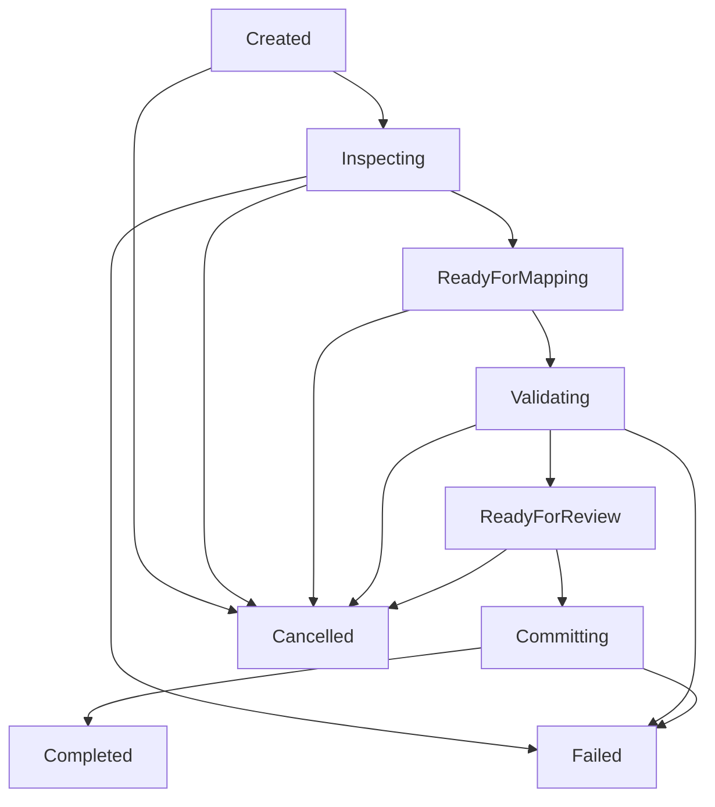

# Import Job Lifecycle Specification

## Lifecycle States

## State Descriptions

1. **`Created`**: Job initialized with `NormalizedWorkbook`.
2. **`Inspecting`**: Source provider inspection and header extraction.
3. **`ReadyForMapping`**: Normalized workbook ready for mapping profile application.
4. **`Validating`**: Mapping executed; rules being evaluated by Validation Engine.
5. **`ReadyForReview`**: Validation completed and Preview Attestation generated.
6. **`Committing`**: Commit request authorized with valid attestation token (Deferred in current milestone).
7. **`Completed`**: Import processing complete.
8. **`Cancelled`**: Job cancelled by user or administrator.
9. **`Failed`**: Exception or unrecoverable error during processing.

## Transition Rules

* `ImportJobTransitionGuard` enforces allowed state transitions.
* Invalid state transitions throw `ImportPlatformException` with error code `IMPORT_INVALID_TRANSITION`.
